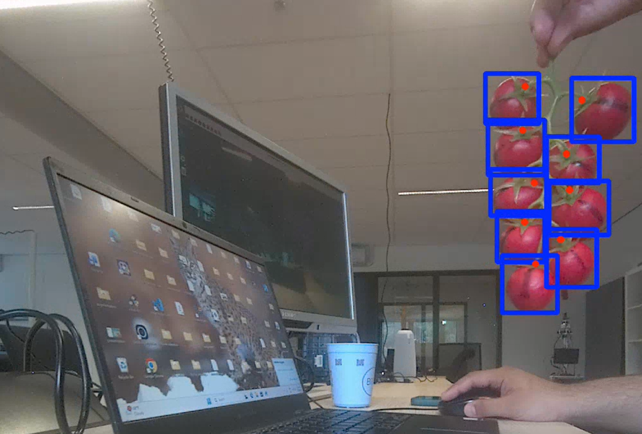

# ZED YOLO Tomato Detection

Real-time tomato detection and stem keypoint estimation using a ZED stereo camera and YOLOv8 Pose.

The system detects tomatoes from the live camera stream and estimates the location of the tomato stem using a trained YOLOv8 Pose model.

## Installation

pip install -r requirements.txt

## Run

python3 main.py

## Features

- Real-time tomato detection using a ZED stereo camera
- YOLOv8 Pose model trained for tomato detection and keypoint estimation
- Bounding box visualization around detected tomatoes
- Single keypoint detection representing the tomato stem
- Stem keypoint displayed with a blue marker
- Real-time FPS monitoring

## Model

The detection model was trained using **YOLOv8 Pose** from Ultralytics.

The model is trained to perform:
- **Object detection:** identify tomatoes and draw bounding boxes
- **Keypoint estimation:** locate the tomato stem position

Each detected tomato contains:

- A bounding box around the tomato
- One keypoint representing the stem location

The stem keypoint is visualized as a red marker in the output frame.

## Requirements

- NVIDIA GPU recommended
- ZED SDK installed
- YOLO trained model
