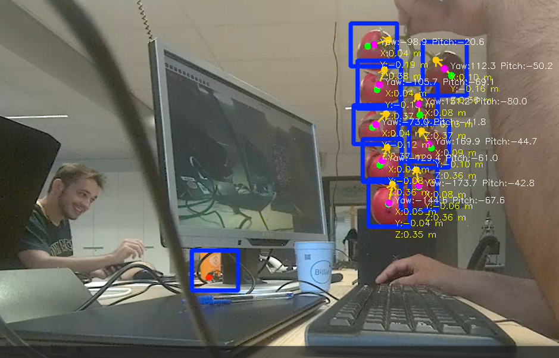

# Tomato 5D Pose Estimation using YOLO and ZED Stereo Camera

## Overview

This project estimates the **5D pose** of tomatoes using a **StereoLabs ZED camera** and a **YOLO keypoint detection model**.

The pipeline is divided into three independent layers:

```
ZED Camera
      │
      ▼
Detection Layer
(YOLO Object Detection + Stem Keypoint)
      │
      ▼
Geometry Layer
(Sphere Center + Diameter)
      │
      ▼
Pose Layer
(3D Position + Orientation)
```

The final output for every detected tomato is:

* **3D position**

  * X (m)
  * Y (m)
  * Z (m)

* **Orientation**

  * Yaw (°)
  * Pitch (°)

Together these form the **5D pose**:

```
[X, Y, Z, Yaw, Pitch]
```

---

## Repository Structure

```
tomato_pose_estimation/
│
├── main.py
├── README.md
├── requirements.txt
├── .gitignore
│
├── models/
│   └── best.pt
│
└── src/
    ├── __init__.py
    ├── detector.py
    ├── geometry.py
    ├── pose.py
    └── utils.py
```

---

## Detection Layer

**File**

```
src/detector.py
```

### Responsibilities

* Load the trained YOLO model
* Detect tomatoes
* Predict stem keypoints
* Return

  * Bounding boxes
  * Stem keypoints

No geometric or pose computations are performed in this layer.

---

## Geometry Layer

**File**

```
src/geometry.py
```

### Responsibilities

Using the detections and the ZED point cloud, this layer computes:

* Tomato center (3D)
* Stem position (3D)
* Orientation reference point (3D)
* Tomato diameter (estimated from the detected image bounding box)

This layer contains only geometric computations and does not estimate orientation angles.

---

## Pose Layer

**File**

```
src/pose.py
```

### Responsibilities

This layer estimates the tomato's pose from the geometry output.

It computes:

* X
* Y
* Z
* Yaw
* Pitch

The output is a **5D pose** represented as:

```
[x, y, z, yaw, pitch]
```

---

## Installation

Clone the repository:

```bash

```

Install the dependencies:

```bash
pip install -r requirements.txt
```

Install the StereoLabs ZED SDK following the official installation guide for your operating system.

Place your trained YOLO model in:

```
models/best.pt
```

---

## Running

```bash
python main.py
```

Press **q** to quit.

---

## Output

For each detected tomato the program estimates:

* 3D position (meters)
* Yaw angle (degrees)
* Pitch angle (degrees)

Example:

```
X = 0.421 m
Y = -0.118 m
Z = 0.673 m
Yaw = 21.4°
Pitch = -6.7°
```


---

## Future Improvements

* Metric diameter estimation using the 3D point cloud
* Roll angle estimation (6D pose)
* Multi-tomato tracking
* ROS 2 integration
* Temporal filtering with a Kalman filter
* Real-time robot grasp planning

---

## Author

Iman Mirzakhah