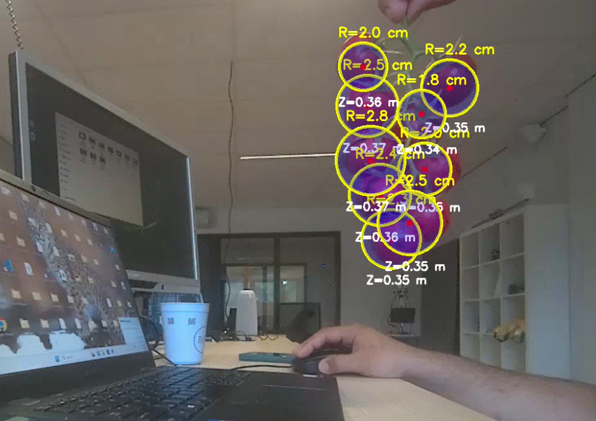

# 🍅 Tomato 3D Sphere Fitting using YOLO and ZED Camera

This project detects tomatoes using a YOLO object detection model and estimates their 3D geometry by fitting a sphere to the point cloud captured by a ZED stereo camera.

The estimated sphere is projected back onto the RGB image, allowing visualization of the tomato's center, radius, and depth in real time.

---

## Features

- Real-time tomato detection with YOLO
- 3D point cloud acquisition using the ZED SDK
- Least-squares sphere fitting
- Depth-based point cloud filtering
- Projection of fitted sphere onto RGB image
- Radius and depth estimation
- Real-time visualization with OpenCV

---

## Project Structure

```
tomato-sphere-fitting/
│
├── main.py
├── requirements.txt
├── README.md
├── .gitignore
│
├── models/
│   └── best.pt
│
├── src/
│   ├── camera.py
│   ├── config.py
│   ├── detector.py
│   ├── geometry.py
│   └── visualization.py

## Requirements

### Hardware

- ZED Stereo Camera
- CUDA-compatible NVIDIA GPU (recommended)

### Software

- Python 3.10+
- ZED SDK
- CUDA Toolkit
- Ultralytics YOLO


Install dependencies:

```bash
pip install -r requirements.txt
```

---


## Running

```bash
python main.py
```

Press **Q** to exit.

---

## Output

For every detected tomato, the program estimates:

- 3D center coordinates
- Sphere radius
- Distance from camera
- Projected sphere overlay



---

## Algorithms

### Object Detection

- YOLO (Ultralytics)

### 3D Reconstruction

- ZED stereo depth estimation

### Geometry

- Least-squares sphere fitting
- Perspective projection

---

## Dependencies

- OpenCV
- NumPy
- Ultralytics
- ZED Python API

---

## Future Improvements

- Multi-object tracking
- Kalman filtering
- RANSAC sphere fitting
- ROS2 integration
- Real-time robot grasp planning

---

## Author

Iman Mirzakhah