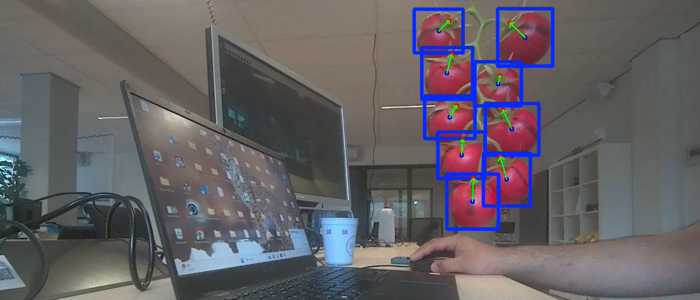

# 🍅 ZED Camera Tomato Detection using YOLO Pose Estimation

Real-time tomato detection and stem localization using a **ZED stereo camera** and a custom-trained **YOLO model**.  
The system detects tomatoes, extracts keypoints (such as the stem position), and visualizes the stem direction vector in real time.

---

